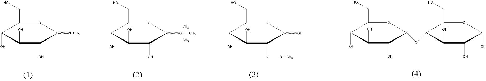
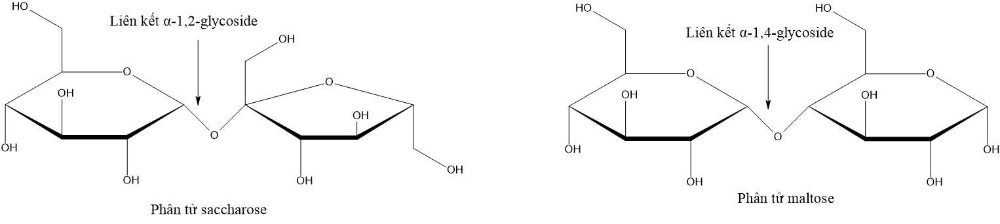
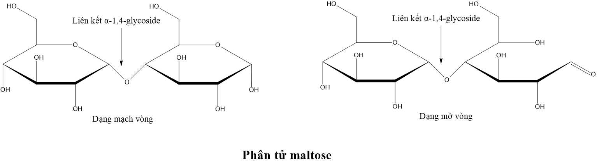
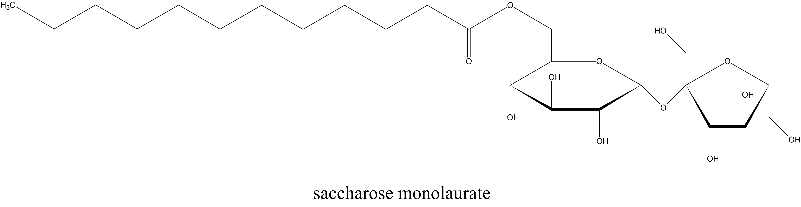

**Câu 1:** Mạch nha là tên gọi khác của carbohydrate nào sau đây?

**A**. Glucose.
**B**. Fructose.
**C**. Saccharose.
**D**. Maltose.   ĐápÁnĐúng  

**Câu 2:** Saccharose được cấu tạo từ:

**A**. hai đơn vị glucose qua liên kết $\alpha-1,4-glycoside$.  
**B**. một đơn vị glucose và một đơn vị fructose qua liên kết $\alpha-1,2-glycoside$.    ĐápÁnĐúng  
**C**. hai đơn vị fructose qua liên kết $\beta-1,4-glycoside$.  
**D**. một đơn vị glucose và một đơn vị galactose qua liên kết $\alpha-1,4-glycoside$.

**Câu 3:** Saccharose được dùng phố biến trong thực phẩm. Phát biểu nào sau đây đúng về saccharose?

**A**. là disaccharide, tạo từ glucose và fructose, tan tốt trong nước.   ĐápÁnĐúng  
**B**. là disaccharide, không tan trong nước, có vị nhạt.  
**C**. là polysaccharide gồm nhiều đơn vị glucose liên kết $\alpha-1,4-glycoside$.  
**D**. là monosaccharide, tan tốt trong nước, có vị ngọt.

**Câu 4:** Maltose được tạo ra từ quá trình nào sau đây?

**A**. Thủy phân saccharose.
**B**. Thủy phân tinh bột.  ĐápÁnĐúng  
**C**. Kết hợp glucose và fructose.
**D**. Lên men ethanol.

**Câu 5:** Saccharose tham gia phản ứng nào sau đây?

**A**. Phân ứng với thuốc thử Tollens.  
**B**. Phân ứng với mước bromine.  
**C**. Phân ứng với $Cu(OH)_2$ tạo dung dịch màu xanh lam.   ĐápÁnĐúng  
**D**. Phân ứng thủy phân trong môi trường kiểm.

**Câu 6:** Saccharose thường được tìm thấy trong loại thực vật nào sau đây?

**A**. Cây đậu nành. 
**B**. Cây lúa mì.
**C**. Cây mía.   ĐápÁnĐúng  
**D**. Cây cà phê.

**Câu 7:** Cho 4 carbohydrate sau: glucose, fructose, maltose, saccharose. Có bao nhiêu carbohydrate đã cho thuộc nhóm disaccharide?

**A**. 1.
**B**. 2.   ĐápÁnĐúng  
**C**. 3.
**D**. 4.

**Câu 8:** Cho 4 carbohydrate sau: glucose, fructose, maltose, saccharose. Số carbohydrate đã cho có liên kết $\alpha-1,4-glycoside$ trong phân tử là

**A**. 1.  ĐápÁnĐúng  
**B**. 2.
**C**. 3.
**D**. 4.

**Câu 9:** Cho 4 carbohydrate sau: glucose, fructose, maltose, saccharose. Số carbohydrate đã cho có liên kết $\alpha-1,2-glycoside$ trong phân tử là

**A**. 1.   ĐápÁnĐúng  
**B**. 2.
**C**. 3.
**D**. 4.

**Câu 10:** Cho 4 carbohydrate sau: glucose, fructose, maltose, saccharose. Carbohydrate nào sau đây có câu trúc phân tử **không** đổi ở trạng thái rắn hoặc trong dung dịch?

**A**. Glucose.
**B**. Fructose.
**C**. Saccharose.   ĐápÁnĐúng  
**D**. Maltose.

**Câu 11:** Cho 4 carbohydrate sau: glucose, fructose, maltose, saccharose. Cấu trúc phân tử của carbohydrate nào trong nhóm nêu trên **không** có nhóm $-OH$ hemiacetal hoặc hemiketal?

**A**. Glucose.
**B**. Fructose.
**C**. Saccharose.   ĐápÁnĐúng  
**D**. Maltose.

**Câu 12:** Cho 4 carbohydrate sau: glucose, fructose, maltose, saccharose.Trong số các carbohydrate đã nêu, số carbohydrate có khả năng mở vòng cho xuất hiện trở lại các nhóm aldehyde $(-CHO)$ hoặc ketone $(>C=O)$ là:

**A**. 1.
**B**. 2.
**C**. 3.  ĐápÁnĐúng  
**D**. 4.

**Câu 13:** Phản ứng đặc trưng của maltose là:

**A**. phản ứng với dung dịch NaOH.  
**B**. phản ứng màu với iodine.  
**C**. phản ứng thủy phân tạo ra glucose.  ĐápÁnĐúng  
**D**. phản ứng lên men trực tiếp tạo ra ethanol.

**Câu 14:** Saccharose và maltose đều tham gia phản ứng nào sau đây?

**A**. Phân ứng với thuốc thử Tolens.  
**B**. Phân ứng thủy phân trong môi trường acid.  ĐápÁnĐúng  
**C**. Phân ứng với dung dịch nước bromine.  
**D**. Phân ứng với $Cu(OH)_2$ tạo kết tủa đồ gạch.

**Câu 15:** Chất nào dưới đây **không** có phản ứng tráng bạc khi cho phản ứng với thuốc thử Tollens?

**A**. Saccharose.  ĐápÁnĐúng  
**B**. Glucose.
**C**. Maltose.
**D**. Fructose.

**Câu 16:** Phát biểu nào sau đây về saccharose là đúng?

**A**. Saccharose không bị thủy phân trong môi trường acid.
**B**. Thủy phân saccharose chỉ thu được glucose.  
**C**. Thủy phân saccharose thu được cả glucose và fructose.  ĐápÁnĐúng  
**D**. Thủy phân saccharose chỉ thu được fructose.

**Câu 17:** Khi cho dung dịch saccharose vào ống nghiệm chứa $Cu(OH)_2$/NaOH, lắc nhẹ ống nghiệm thì thấy có hiện tượng nào sau đây?

**A**. Kim loại màu vàng sáng bám trên bề mặt ống nghiệm.  
**B**. Kết tủa màu đỏ gạch xuất hiện trong ống nghiệm.  
**C**. Dung dịch trở nên đồng nhất và có màu xanh lam.  ĐápÁnĐúng  
**D**. Chất lỏng trong ống nghiệm tách thành hai lớp và xuất hiện kết tủa màu xanh nhạt lắng xuống đáy ống nghiệm.

**Câu 18:** Chất X có các đặc điểm sau: phân tử có nhiều nhóm $-OH$, có vị ngọt, hòa tan $Cu(OH)_2$ ở nhiệt độ thường, phân tử có liên kết glycoside, **không** làm mất màu nước bromine. Chất X là

**A**. tinh bột.
**B**. saccharose.  ĐápÁnĐúng  
**C**. glucose.
**D**. cellulose.

**Câu 19:** Phát biểu nào sau đây về maltose là đúng?

**A**. Được cấu tạo từ 1 đơn vị α-glucose và 1 đơn vị β-fructose.  
**B**. Có nhiều trong cây mía, hoa thốt nốt, củ cải đường.  
**C**. Không chứa nhóm $-OH$ hemiacetal.  
**D**. Là chất rắn ở điều kiện thường.  ĐápÁnĐúng  

**Câu 20:** Saccharose và maltose là disaccharide tạo bởi lần lượt các liên kết

**A**. $\alpha-1,2-glycoside$ và $\alpha-1,2-glycoside$.  
**B**. $\beta-1,4-glycoside$ và $\beta-1,2-glycoside$.  
**C**. $\alpha-1,2-glycoside$ và $\alpha-1,4-glycoside$.  ĐápÁnĐúng  
**D**. $\alpha-1,4-glycoside$ và $\beta-1,4-glycoside$.

**Câu 21:** Carbohydrate Z tham gia chuyển hóa như bên dưới. Z **không** thể là chất nào dưới đây?

*(1)* $Z \xrightarrow{Cu(OH)_{2}/OH^{-}}$ dung dich xanh lam  
*(2)* $Z \xrightarrow{Cu(OH)_{2}/OH^{-}, t^{0}}$ kết tủa đỏ gạch

**A**. Glucose.  
**B**. Fructose.  
**C**. Saccharose.  ĐápÁnĐúng  
**D**. Maltose.  

**Câu 22:** Trong công nghiệp thực phẩm, saccharose được sử dụng phổ biến làm nguyên liệu để sản xuất bánh kẹo, nước giải khát... Phát biểu nào sau đây là sai?

**A**. Saccharose thuộc loại disaccharide.  
**B**. Dung dịch saccharose hoà tan được $Cu(OH)_2$ cho dung dịch màu xanh lam.  
**C**. Thủy phân saccharose chỉ thu được glucose.  ĐápÁnĐúng  
**D**. Saccharose thương được tách từ nguyên liệu là cây mía, cù cải đường,...

**Câu 23:** Phát biểu nào sau đây là đúng?

**A**. Glucose tinh khiết là chất chất rắn, không tan trong nước.  
**B**. Fructose tinh khiết là chất rắn, có vị chua của hoa quả.  
**C**. Saccharose tinh khiết là chất rắn, màu nâu, có vị ngọt.  
**D**. Maltose tinh khiết là chất rắn, tan tốt trong nước, có vị ngọt.  ĐápÁnĐúng  

**Câu 24:** Cho 4 chất như hình bên dưới. Chất thuộc loại disaccharide là

**A**. (1).  
**B**. (2).  
**C**. (3).  
**D**. (4).  ĐápÁnĐúng  

**Câu 25:** Sắp xếp các chất sau đây theo thứ tự độ ngọt tăng dân (cùng một lượng): glucose, fructose, saccharose.

**A**. Glucose < saccharose < fructose.  ĐápÁnĐúng  
**B**. Fructose < glucose < saccharose.  
**C**. Glucose < fructose < saccharose.  
**D**. Saccharose < fructose < glucose.

**Câu 26:** Loại glucide **không** có tính khử là

**A**. glucose.  
**B**. fructose.  
**C**. saccharose.  ĐápÁnĐúng  
**D**. maltose.

**Câu 27:** Saccharose và glucose đều

**A**. phần ứng với dung dịch NaCl.  
**B**. phản ứng với $Cu(OH)_2$ ở nhiệt độ thường tạo thành dung dịch xanh lam.  ĐápÁnĐúng  
**C**. phản ứng với $AgNO_3$ trong dung dịch $NH_3$, đun nóng.  
**D**. phản ứng thủy phân trong môi trường acid.

**Câu 28:** Dãy các chất nào dưới đây đều phản ứng được với $Cu(OH)_2$ ở điều kiện thường?

**A**. Ethylene glycol, glycerol và ethyl alcohol.  
**B**. Glucose, glycerol và saccharose.  ĐápÁnĐúng  
**C**. Glucose, glycerol và methyl acetate.  
**D**. Glycerol, glucose và ethyl acetate.

**Câu 29:** Dung dịch nước của một carbohydrate X có 3 tính chất sau. X có thể là dung dịch của chất nào ?

*(a)* Hòa tan dung dịch $Cu(OH)_2$ tạo ra dung dịch có màu xanh lam.  
*(b)* Không cho kết tủa bạc khi tác dụng với thuốc thử Tollens.  
*(c)* Đun nóng với dung dịch acid loãng, sản phẩm thu được kết tủa $Cu_2O$ với tác nhân $Cu(OH)_2$.

**A**. Glucose.
**B**. Saccharose.  ĐápÁnĐúng  
**C**. Maltose.
**D**. Celluose.

**Câu 30:** Các phát biểu về cấu tạo của saccharose và maltose:

*a)* Maltose được tạo thành từ hai đơn vị fructose.  ĐápÁnSai  
*b)* Maltose có liên kết $\alpha-1,4-glycoside$ giữa hai đơn vị glucose.  ĐápÁnĐúng  
*c)* Phân tử saccharose chứa một liên kết $\beta-1,2-glycoside$.  ĐápÁnSai  
*d)* Phân tử saccharose chỉ tôn tại dạng mạch vòng.  ĐápÁnĐúng  

**Câu 31:** Các phát biểu về tính chất của saccharose và maltose:

*a)* Saccharose không thể tạo dung dịch màu xanh lam khi phản ứng với $Cu(OH)_2$.  ĐápÁnSai  
*b)* Saccharose không phản ứng với thuốc thử Tollens.  ĐápÁnĐúng  
*c)* Saccharose có thể bị thủy phân thành glucose và fructose.  ĐápÁnĐúng  
*d)* Maltose có thể phản ứng với thuốc thử Tollens và làm mất màu nước bromine.  ĐápÁnĐúng  

**Câu 32:** Cấu trúc phân tử saccharose và maltose được cho dưới đây:

*a)* Phân tử saccharose không còn nhóm $-OH$ hemiacetal và nhóm $-OH$ hemiketal.  ĐápÁnĐúng  
*b)* Phân tử saccharose và maltose đều không có khả năng mở vòng.  ĐápÁnSai  
*c)* Phân tử saccharose tạo bởi một đơn vị β-glucose và một đơn vị α-fructose, liên kết với nhau qua nguyên tử oxygen giữa $C_{1}$ của đơn vị β-glucose và $C_{4}$ của đơn vị α-fructose.  ĐápÁnSai  
*d)* Saccharose và maltose đều là các disaccharide.  ĐápÁnĐúng  

**Câu 33:** Quan sát cấu trúc phân tử maltose dạng mạch vòng và dạng mở vòng sau:

*a)* Phân tử maltose tạo bởi hai đơn vị glucose, liên kết với nhau qua nguyên tử oxygen giữa $C_{1}$ của đơn vị glucose này và $C_{4}$ của đơn vị glucose kia.  ĐápÁnĐúng  
*b)* Phân tử maltose còn một nhóm $-OH$ hemiacetal.  ĐápÁnĐúng  
*c)* Thủy phân maltose chỉ thu được glucose.  ĐápÁnĐúng  
*d)* Maltose không có khả năng phản ứng với thuốc thử Tollens.  ĐápÁnSai  

**Câu 34:** Saccharose monolaurate là ester thu được khi cho saccharose tác dụng với lauric acid.

*a)* Công thức phân tử của saccharose monolaurate $C_{24}H_{45}O_{12}$.   ĐápÁnSai  
*b)* Saccharose monolaurate là hợp chất hữu cơ tạp chức.  ĐápÁnĐúng  
*c)* Saccharose monolaurate có phản ứng với thuốc thử Tollens.   ĐápÁnSai  
*d)* Từ $500g$ saccharose và $100g$ lauric acid điều chế được $123,14g$ saccharose monolaurate. Cho biết hiệu suất phản ứng đạt $47\%$.  ĐápÁnĐúng  

**Câu 35:** Saccharose có công thức phân tử $C_{12}H_{22}O_{11}$ , cấu tạo từ một đơn vị α-glucose và một đơn vị β-fructose qua liên kết $\alpha-1,2-glycoside$. Tổng số nhóm $-OH$ trong phân tử saccharose là bao nhiêu?

Đáp án là: 8

**Câu 36:** Trong số 4 carbohydrate: glucose, fructose, saccharose, maltose có
bao nhiêu carbohydrate có nhóm $-OH$ hemiacetal trong phân tử?

Đáp án là: 3