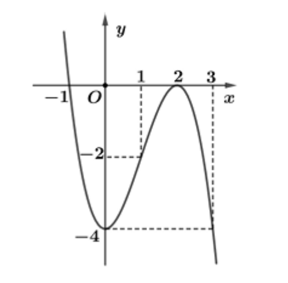
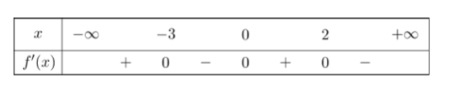
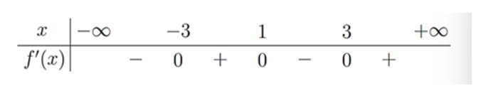
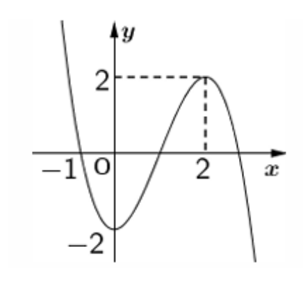
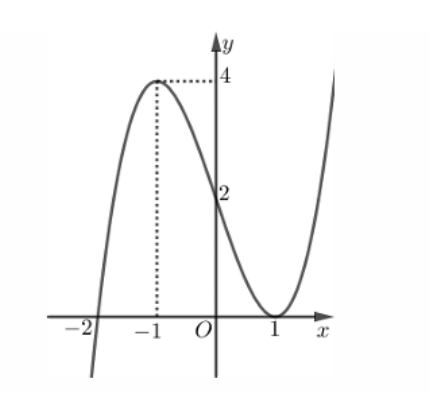
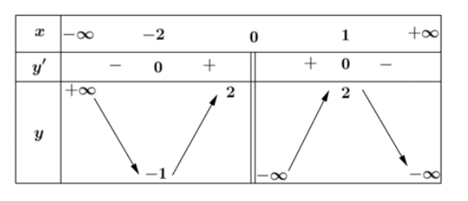

Câu 1. Hàm số nào sau đây đồng biến trên $\mathbb{R}$?

A. $y = x^{3} - 3x^{2} - 1$   
B. $y = x^{3} - x^{2} + 6x - 1$ ĐápÁnĐúng  
C. $y = \frac{x - 2}{x + 1}$  
D. $y = x^{4} + 2x^{2} - 1$

Câu 2. Cho hàm số $f(x)$ có bảng xét dấu đạo hàm như sau. Hàm số đã cho nghịch biến trên khoảng nào dưới đây?

A. $(2;+\infty)$ ĐápÁnĐúng  
B. $(-\infty;-2)$  
C. $(-2;+\infty)$  
D. $(-2;1)$  

Câu 3. Cho hàm số $y = f(x)$ có đồ thị là đường cong hình bên dưới. Hàm số đã cho nghịch biến trên khoảng nào dưới đây?

A. $(-1;1)$  
B. $(1;+\infty)$ ĐápÁnĐúng  
C. $(0;1)$  
D. $(-1;+\infty)$

Câu 4. Cho hàm số $y = \frac{-x + 2}{x - 1}$ , khẳng định nào dưới đây là khẳng định đúng?

A. Hàm số nghịch biến trên khoảng $(-\infty;1)\cup(1;+\infty)$  
B. Hàm số nghịch biến trên mỗi khoảng $(-\infty;1)$ và $(1;+\infty)$ ĐápÁnĐúng  
C. Hàm số nghịch biến trên R.  
D. Hàm số đồng biến trên mỗi khoảng $(-\infty;1)$ và $(1;+\infty)$

Câu 5. Cho hàm số $y = f(x) = ax^{3} + bx^{2} + cx + d$ có đồ thị như hình vẽ dưới đây. Hàm số $y = f(x)$ đồng biến trên khoảng nào?

A. $(-1;1)$  
B. $(-\infty;-1)$  
C. $(2;+\infty)$  
D. $(0;1)$ ĐápÁnĐúng  

Câu 6. Hàm số $y = 2x^{3} - 2x^{2} - 2x + 1$ đồng biến trên khoảng nao dưới đây?

A. $(-1;1)$  
B. $(-\infty;1)$  
C. $(0;2)$  
D. $(1; 2)$ ĐápÁnĐúng  

Câu 7. Hàm số $y = \frac{x + 3}{x - 2}$ nghịch biến trên khoảng nào sau đây?

A. $(-2;3)$  
B. $(-\infty;3)$  
C. $(-\infty;+\infty)$  
D. $(3; +\infty)$ ĐápÁnĐúng  

Câu 8. Cho hàm số $f(x)$ có bằng xét dấu đạo hàm như sau. Hàm số đã cho nghịch biến trên khoảng nào dưới đây?

A. $(-3;0)$ ĐápÁnĐúng  
B. $(0;+\infty)$  
C. $(0;2)$  
D. $(-\infty;-3)$  

Câu 9. Cho hàm số $y = \frac{x-3}{x+1}$ Mệnh đề nào dưới đây đúng?

A. Hàm số đồng biến trên $\mathbb{R} \setminus \{-1\}$ ĐápÁnĐúng  
B. Hàm số đồng biến trên $(-\infty; +\infty)$  
C. Hàm số nghịch biến trên $(-\infty;-1)$  
D. Hàm số đồng biến trên $(-\infty; -1)$

Câu 10. Cho hàm số $y = f(x)$ có đạo hàm $f'(x) = (x + 1)(2x - 5)^{2}$ với mọi $x \in \mathbb{R}$ Hàm số đã cho nghịch biến trên khoảng nào?

A. $(-\infty;-1)$ ĐápÁnĐúng  
B. $(-1;3)$  
C. $(-1;+\infty)$  
D. $(-3;1)$

Câu 11. Cho hàm số $f(x)$ có bằng xét dấu đạo hàm như sau. Hàm số đã cho nghịch biến trên khoảng nào dưới đây?

A. $(-3;0)$ ĐápÁnĐúng  
B. $(0;+\infty)$  
C. $(0;2)$  
D. $(-\infty;-3)$  

Câu 12. Cho hàm số $f(x)$ liên tục trên $\mathbb{R}$ và có đạo hàm $f'(x) = (x+1)(x-1)^{4}(2-x)$ Mệnh đề nào dưới đây đúng?

A. $f(5) > f(4) > f(3)$  
B. $f(-1) > f(0) > f(1)$  
C. $f(-3) < f(-2) < f(-1)$  
D. $f(0) < f(1), f(2)$ ĐápÁnĐúng

Câu 13. Cho hàm số $f(x)$ xác định trên $\mathbb{R}$ và có đạo hàm $f'(x) = (2 - x)(x + 1)^{2}(x - 1)^{5}$ Hàm số đã cho nghịch biến trên khoảng nào dưới đây?

A. $(-\infty;2)$  
B. $(2;+\infty)$ ĐápÁnĐúng  
C. $(-1;2)$  
D. $(1;+\infty)$  

Câu 14. Cho hàm số $y = \frac{2025x - 2024}{x + 1}$ Khẳng định nào dưới đây là sai?

A. Hàm số đồng biến trên khoảng $(-\infty;1)$  
B. Hàm số đồng biến trên khoảng $(-\infty; -1)$ ĐápÁnĐúng  
C. Hàm số đồng biến trên khoảng (1; 2025).  
D. Hàm số đồng biến trên khoảng (-1; 2025).  

Câu 15. Hàm số $y = -x^{4} + 2x^{2} + 1$ đồng biến trên khoảng nào dưới đây?

A. $(0;+\infty)$  
B. $(-2;3)$  
C. $(-5;-2)$ ĐápÁnĐúng  
D. $(3;+\infty)$  

Câu 16. Hàm số $y = \sqrt{8 + 2x - x^2}$ đồng biến trên khoảng nào dưới đây?

A. $(1:+\infty)$  
B. $(-\infty;1)$  
C. $(-2;1)$ ĐápÁnĐúng  
D. $(1; 4)$

Câu 17. Cho hàm số $y = f(x)$ có đạo hàm trên $\mathbb{R}$ và hàm số $y = f'(x)$ là hàm số bậc ba có đường cong trong hình vẽ. Hàm số $y = f(x)$ nghịch biến trên khoảng nào?

A. $(-\infty;1)$ ĐápÁnĐúng  
B. $(-2;0)$  
C. $(1; +\infty)$  
D. $(-1;+\infty)$  

Câu 18. Hàm số $y = \frac{x^2 - 2x + 5}{x - 1}$ đồng biến trên khoảng nào sau đây?

A. $(-\infty;5)$  
B. $(-3;+\infty)$  
C. $(3; +\infty)$ ĐápÁnĐúng  
D. $(-3;5)$  

Câu 19. Cho hàm số $y = f(x)$ có đạo hàm là $f'(x) = (x - 1)^{2}(3 - x)(x^{2} - x - 1)$. Hỏi hàm số có bao nhiêu cực tiểu?

A. 3.  
B. 2.  
C. 0.  
D. 1. ĐápÁnĐúng  

Câu 20. Tìm giá trị cực tiểu của hàm số $y = -x^{3} + 3x + 4$

A. $y_{CT} = 2$ ĐápÁnĐúng  
B. $y_{CT} = 1$  
C. $y_{CT} = 6$  
D. $y_{CT} = -1$  

Câu 21. Cho hàm số $y = f(x)$ liên tục trên $\mathbb{R}$ và có $f'(x) = (x - 1)^{2}(x^{2} - 5x + 6)$ Số điểm cực trị của hàm số đã cho là

A. 5.  
B. 3.  
C. 2. ĐápÁnĐúng  
D. 4.  

Câu 22. Cho hàm số $f(x)$ có đạo hàm $f'(x) = (x - 1)(2 - x)$ với mọi $x \in \mathbb{R}$. Điểm cực đại của hàm số là

A. $x = 1$  
B. $x = -2$  
C. $x = 2$ ĐápÁnĐúng  
D. $x = -1$  

Câu 23. Cho hàm số $y = x^{3} - 3x^{2} + 2$ Điểm cực tiểu của đồ thị hàm số có tọa độ là

A. $(2;2)$  
B. $(2;-2)$ ĐápÁnĐúng  
C. $(0;-2)$  
D. $(0;2)$  

Câu 24. Cho hàm số $y = f(x)$ có đạo hàm $f'(x) = x^{2}(x + 1)^{2}(2x - 1)$ Số điểm cực trị của $f(x)$ là

A. 3.  
B. 0.  
C. 1. ĐápÁnĐúng  
D. 2.  

Câu 25. Cho hàm số $y = f(x)$ có bảng xét dấu đạo hàm như hình bên. Số điểm cực tiểu của $y = f(x)$ là

A. 3.  
B. 4.  
C. 2. ĐápÁnĐúng  
D. 1.  

Câu 1: Cho hàm số $y = f(x) = x^{4} - 2x^{2} + 2$

a) Tập xác định của hàm số $\mathbb{D} = [0; +\infty)$ ĐápÁnSai  
b) Hàm số đồng biến trên khoảng (2; 0) ĐápÁnSai  
c) Hàm số đồng biến trên $(- \frac{1}{2}; +\infty)$ ĐápÁnSai  
d) Hàm số nghịch biến trên các khoảng $(-\infty; -1)$ và $(0; 1)$ ĐápÁnĐúng

Câu 2: Cho hàm số $y = \frac{x-1}{x+2}$

a) Tập xác định của hàm số là $\mathbb{D} = \mathbb{R}$ .  
b) Hàm số nghịch biến trên $\mathbb{R} \setminus \{-2\}$ .  
c) Hàm số đồng biến trên $\mathbb{R} \setminus \{-2\}$ .  
d) Hàm số nghịch biến trên các khoảng $(-\infty; -2)$ và $(-2; +\infty)$ .

Câu 3: Cho hàm số $y = f(x)$ có đồ thị như hình vẽ

a) Hàm số $y = f(x)$ đồng biến trên khoảng (0; 2)  
b) Hàm số $y = f(x)$ nghịch biến trên mỗi khoảng $(-∞;0)$ , $(2;+∞)$  
c) Với mọi $x \in (0;2)$ thì hàm số $y = f(x)$ luôn nhận giá trị dương  
d) Hàm số $y = f(-x)$ nghịch biến trên khoảng $(-2;0)$

Câu 4: Cho hàm số $y = \frac{x^{2} + x - 1}{x - 1}$

a) Tập xác định của hàm số là $D = \mathbb{R} \setminus \{1\}$  
b) Phương trình $y' = 0$ có hai nghiệm nguyên  
c) Hàm số đồng biến trên mỗi khoảng (0; 1) và (2; +∞)  
d) Hàm số nghịch biến trên mỗi khoảng (0; 1) và (1; 2)

Câu 5: Cho hàm số $y = \frac{x + 3}{x - 1}$

a) Tập xác định của hàm số là $D = \mathbb{R} \setminus \{1\}$  
b) Hàm số đã cho đồng biến trên \{1\}  
c) Đạo hàm của hàm số luôn nhỏ hơn 0 với mọi $x \neq 1$  
d) Hàm số đã cho không có cực trị

Câu 6: Cho hàm số $y = \sqrt{x^{2} + 1}$

a) Hàm số đạt cực đại tại x = 0 .  
b) Hàm số không có cực trị.  
c) Hàm số đạt cực tiểu tại x = 0.  
d) Hàm số có hai điểm cực trị.

Câu 7: Cho hàm số $y = -\frac{1}{2}x^4 + x^2 + \frac{1}{2}$ .

a) Hàm số đạt cực tiểu tại x = 0, giá trị cực tiểu của hàm số là $y(0) = 0$ .  
b) Hàm số đạt cực tiểu tại các điểm $x = \pm1$ , giá trị cực tiểu của hàm số là $y(\pm1)=1.$  
c) Hàm số đạt cực đại tại các điểm $x = \pm1$ , giá trị cực tiểu của hàm số là $y(\pm1)=\frac{1}{2}.$  
d) Hàm số đạt cực tiểu tại x = 0, giá trị cực tiểu của hàm số là $y(0) = \frac{1}{2}$ .

Câu 8: Cho hàm số $y = f(x)$ có đạo hàm liên tục trên $\mathbb{R}$ và hàm số $y = f'(x)$ có đồ thị như hình vẽ dưới đây

a) Hàm số $y = f(x)$ đặt cực tiểu tại điểm $x = -1$ và giá trị cực đại là $y_{C\text{CE}} = 4$ .  
b) Hàm số $y = f(x)$ đặt cực tiểu tại điểm $x = 1$ và giá trị cực tiểu là $y_{CT} = 0$ .  
c) Hàm số $y = f(x)$ đặt cực tiểu tại điểm x = -2.  
d) Hàm số $y = f(x)$ đạt cực đại tại điểm x = -2.

Câu 9: Cho hàm số $y = f(x)$ có bằng biến thiên như hình vẽ

a) Giá trị cực tiểu của hàm số bằng -1.  
b) Hàm số đạt cực tiểu tại x = -2.  
c) Giá trị cực đại của hàm số bằng 2.  
d) Hàm số đạt cực đại tại x = 0 và x = 1.

Câu 10: Xét một chất điểm chuyển động dọc theo trực Ox. Toạ độ của chất điểm tại thời điểm t được xác định bởi hàm số $x(t) = t^3 - 6t^2 + 9t$ với $t \geq 0$ , khi đó $x'(t)$ là vận tốc của chất điểm tại thời điểm t, kí hiệu $v(t)$ ; $v'(t)$ là gia tốc chuyển động của chất điểm tại thời điểm t, kí hiệu $a(t)$ .

a) Phương trình vận tốc là $v(t) = 3t^{2} - 6t + 9$ .  
b) Phương trình hàm gia tốc là $a(t) = 6t - 12$ .  
c) Vận tốc của chất điểm tăng khi $t \in (0;1) \cup (3;+\infty)$ .  
d) Vận tốc của chất điểm giảm khi $t \in (1;3)$