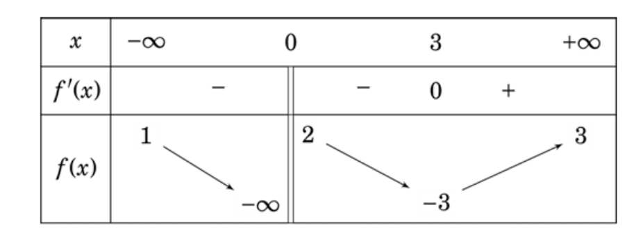
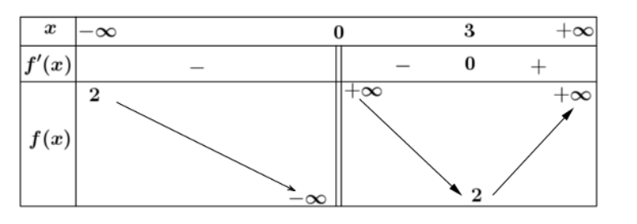
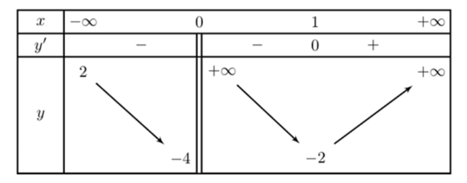
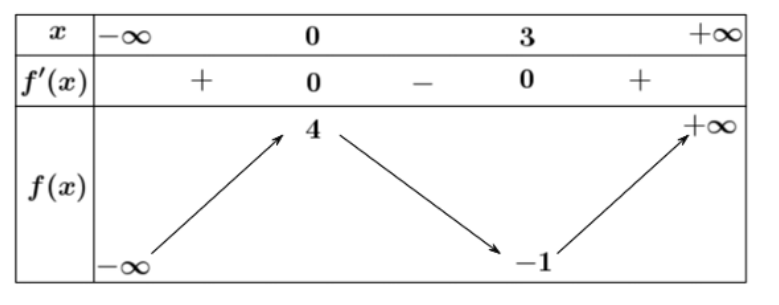
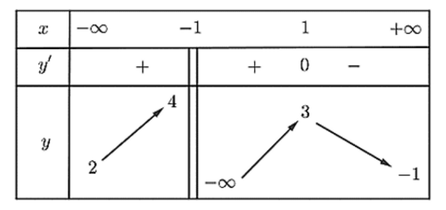
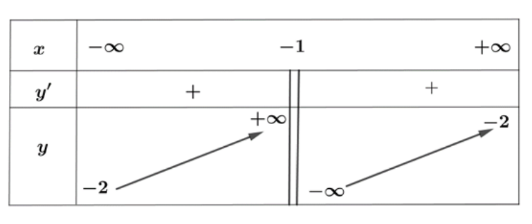
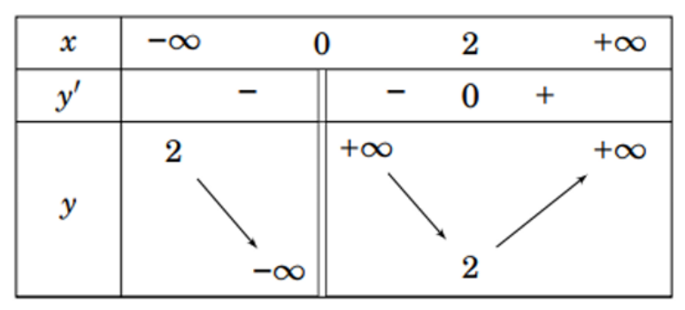
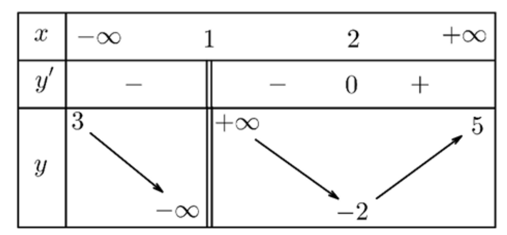
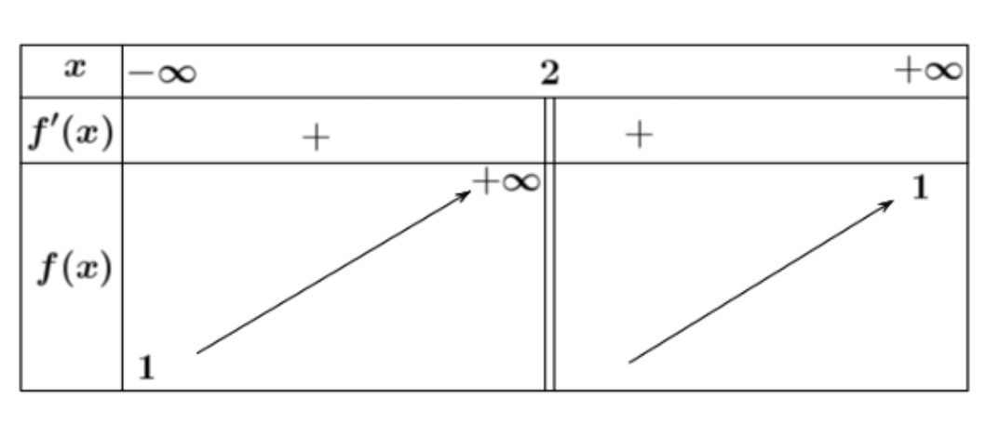

Câu 1. Đồ thị hàm số $y = \frac{x - 2}{x^2 - 4}$ có đường tiệm cận ngang là:

A. $y = 2$  
B. $y = 0$  ĐápÁnĐúng  
C. $y = 1$  
D. $y = -2$  

Câu 2. Đường tiệm cận của đồ thị hàm số $y = \frac{1}{x^2 + 1}$ có phương trình

A. $y = 2$  
B. $y = 3$  
C. $y = 1$  
D. $y = 0$  ĐápÁnĐúng  

Câu 3. Đồ thị của hàm số nào dưới đây có tiệm cận ngang?

A. $y = x^{3} - x - 1$  
B. $y = \sqrt{2x^2 + 3}$  
C. $y = \frac{x^{3} + 1}{x^{2} + 1}$  
D. $y = \frac{3x^2 + 2x - 1}{4x^2 + 5}$  ĐápÁnĐúng  

Câu 4. Đường tiệm cận đứng của đồ thị hàm số $y = \frac{x^2 + x - 2}{x - 2}$

A. $x = 2$  ĐápÁnĐúng  
B. $x = -2$  
C. $y = -2$  
D. $y = 2$  

Câu 5. Phương trình đường tiệm cận đứng của đồ thị hàm số $y = \frac{3}{x+2}$

A. $x = -2$  ĐápÁnĐúng  
B. $x = 0$  
C. $x = 3$  
D. $y = 0$  

Câu 6. Tiệm cận đứng của đồ thị hàm số $y = \frac{3x + 6}{x - 2}$ là đường thẳng

A. $x = 3$  
B. $x = -2$  
C. $x = -3$   
D. $x = 2$  ĐápÁnĐúng  

Câu 7. Tiệm cận ngang của đồ thị hàm số $y = \frac{2}{x-1}$ là đường thẳng:

A. $x = 1$  
B. $y = 2$  
C. $x = 0$  
D. $y = 0$  ĐápÁnĐúng  

Câu 8. Cho hàm số $f(x)$ có bảng biến thiên như hình bên dưới. Số tiệm cận đứng của đồ thị hàm số đã cho là

A. $3$  
B. $1$  ĐápÁnĐúng  
C. $2$  
D. $0$  

Câu 9. Cho hàm số $y = f(x)$ xác định và liên tục trêm $(\infty;0)$ và $(0;+\infty)$ có bảng biến thiên như hình vẽ. Mệnh đề nào sau đây đúng?

A. Đường thẳng $x = 2$ là tiệm cận đứng của đồ thị hàm số  
B. Đồ thị hàm số có hai đường tiệm cận ngang  
C. Đồ thị hàm số có hai đường tiệm cận  ĐápÁnĐúng  
D. Đồ thị hàm số chỉ có một đường tiệm cận  

Câu 10. Cho hàm số $f(x)$ có bảng biến thiên như bên dưới. Tổng số tiệm cận ngang và tiệm cận đứng của đồ thị hàm số đã cho là

A. $1$  
B. $3$  
C. $4$  
D. $2$  ĐápÁnĐúng  

Câu 11. Cho hàm số $f(x)$ có bảng biến thiên như bên dưới. Mệnh đề nào sau đây đúng?

A. Đồ thị hàm số có 2 đường tiệm cận ngang.  
B. Đồ thị hàm số có đường tiệm cận ngang y = 4.  
C. Đồ thị hàm số không có tiệm cận.  ĐápÁnĐúng  
D. Đồ thị hàm số có đường tiệm cận đứng x = 0.

Câu 12. Cho hàm số $y = f(x)$ xác định trên $\mathbb{R} \setminus  \{1\}$ , liên tục trên mỗi khoảng xác định và có bảng biến thiên như hình bên dưới. Hỏi đồ thị hàm số có tất cả bao nhiêu đường tiệm cận đứng và tiệm cận ngang?

A. $1$  
B. $0$  
C. $3$  ĐápÁnĐúng  
D. $2$  

Câu 13. Cho hàm số $y = f(x)$ xác định là liên tục trên $\mathbb{R} \setminus \{1\}$ , có bảng biến thiên như hình bên dưới. Khẳng định nào sau đây đúng?

A. Đồ thị hàm số có tiệm cận đứng $y = -1$ và tiệm cận ngang $x = -2$  
B. Đồ thị hàm số có duy nhất một tiệm cận   
C. Đồ thị hàm số có ba tiệm cận  
D. Đồ thị hàm số có tiệm cận đứng $x = -1$ và tiệm cận ngang $y = -2$  ĐápÁnĐúng  

Câu 14. Tổng số tiệm cận đứng và tiệm cận ngang của đồ thị hàm số $y = \frac{2x^{2} - 3x + 1}{x^{2} - 1}$ là

A. $1$  
B. $0$  
C. $3$  
D. $2$  ĐápÁnĐúng  

Câu 15. Tổng số đường tiệm cận đứng và tiệm cận ngang của đồ thị hàm số $y = \frac{x^2 - 3x + 2}{x^2 - 1}$ là

A. $3$  
B. $4$  
C. $1$  
D. $2$  ĐápÁnĐúng  

Câu 16. Cho hàm số $y = \frac{2x^{2} + x - 1}{x - 1}$ có 
 ( $C$ ). Số tiệm cận đứng và tiệm cận ngang của ( $C$ ) là

A. $0$  
B. $1$  ĐápÁnĐúng  
C. $3$  
D. $2$  

Câu 17. Tổng số đường tiệm cận đứng và tiệm cận ngang của đồ thị hàm số $y = \frac{(x-2)\sqrt{x-1}}{x^{2}-1}$

A. $3$  
B. $2$  ĐápÁnĐúng  
C. $0$  
D. $1$  

Câu 18. Đồ thị hàm số $y = \frac{x^2 - 1}{3 - 2x - 5x^2}$ có bao nhiêu đường tiệm cận đứng?

A. $0$  
B. $1$  ĐápÁnĐúng  
C. $2$  
D. $3$  

Câu 19. Tổng số đường tiệm cận đứng và tiệm cận ngang của đồ thị hàm số $y = \frac{x - 2}{x^{2} - 4}$

A. $2$  ĐápÁnĐúng  
B. $3$  
C. $1$  
D. $0$  

Câu 20. Cho hàm số $y = \frac{x+1}{x^2-2x-3}$ . Tổng số tiệm cận đứng và tiệm cận ngang của Đồ thị hàm số đã cho là

A. $2$  ĐápÁnĐúng  
B. $4$  
C. $3$  
D. $1$  

Câu 21. Tổng số tiệm cận đứng và tiệm cận ngang của đồ thị hàm số $y = \frac{3x^{2} - 2x - 1}{x^{2} - 1}$ là:

A. $4$  
B. $2$  ĐápÁnĐúng  
C. $1$  
D. $3$  

Câu 22. Tổng số đường tiệm cận đứng và tiệm cận ngang của đồ thị hàm số $y = \frac{2x - 1}{x^2 - x}$ là

A. $0$  
B. $1$  
C. $2$  
D. $3$  ĐápÁnĐúng  

Câu 23. Đường tiệm cận ngang của đồ thị hàm số $y = \frac{x+1}{x^2-4}$ có phương trình là

A. $y = -2$  
B. $y = 2$  
C. $y = 0$  ĐápÁnĐúng  
D. $y = -1$  

Câu 24. Tìm số đường tiệm cận đứng của hàm số $y = \frac{x^2 - 3x - 4}{x^2 - 16}$

A. $0$  
B. $3$  
C. $2$  
D. $1$  ĐápÁnĐúng  

Câu 25: Cho hàm số $y = f(x)$ có bảng biến thiên như hình vẽ dưới đây:

a) $f(-5) < f(4)$  ĐápÁnĐúng  
b) Hàm số có giá trị nhỏ nhất bằng 2  ĐápÁnSai  
c) Đồ thị hàm số có tiệm cận đứng x = 0  ĐápÁnĐúng  
d) Đồ thị hàm số không có tiệm cận ngang  ĐápÁnSai  

Câu 26: Cho hàm sô $y = \frac{5 - 4x}{2x + 3}$ có đồ thị là (C)

a) Hàm số đã cho không có cực trị  ĐápÁnĐúng  
b) Đồ thị hàm số có tiệm cận đứng x = -3  ĐápÁnSai  
c) Đồ thị hàm số có tiệm cận ngang y = -2  ĐápÁnĐúng  
d) Các đường tiệm cận của đồ thị hàm số tạo với hai trực toạ độ một hình chữ nhật có diện tích bằng 3  ĐápÁnĐúng  

Câu 27: Cho hàm số $y = \frac{x^2 - 3x + 2}{4 - x^2}$ có đồ thị là (C)

a) Tập xác định của hàm số đã cho là $\mathbb{D} = \mathbb{R}$  ĐápÁnSai    
b) Đồ thị hàm số đã cho có hai đường tiệm cận ngang, trong đó có một đường là đường thẳng có phương trình $y = -1$  ĐápÁnSai  
c) Đồ thị hàm số có một đường tiệm cận đứng là đường thẳng $x = -2$  ĐápÁnĐúng  
d) Tổng số tiệm cận đứng và tiệm cận ngang của đồ thị hàm số là 3  ĐápÁnSai  

Câu 28: Cho hàm số $y = f(x)$ , xác định trên $\mathbb{R} \setminus \{1\}$ , liên tục trên mỗi khoảng xác định và có bảng biến thiên như hình bên dưới

a) Hàm số đã cho nghịch biến trên khoảng $(-\infty;2)$ và đồng biến trên khoảng $(2;+\infty)$  ĐápÁnSai  
b) Đồ thị hàm số $y = f(x)$ có một đường tiệm cận đứng là $x = 1$  ĐápÁnĐúng  
c) Đồ thị hàm số $y = f(x)$ có một đường tiệm cận ngang $y = 3$  ĐápÁnĐúng  
d) Đồ thị hàm số $y = \frac{1}{f(x)+2}$ có hai đường tiệm cận đứng  ĐápÁnĐúng  

Câu 29: Biết rằng đồ thị hàm số $y = \frac{ax + 1}{bx - 2}$ có tiệm cận đứng là $x = 2$ và tiệm cận ngang $y = 3$ . Tính giá trị của biểu thức $a - 2b$

Đáp án là: 1

Câu 30: Gọi $I(a; b)$ là giao điểm của đường tiệm cận đứng và tiệm cận ngang của đồ thị hàm số $y = \frac{x - 2}{x + 2}$. Tính $T = a + b$  

Đáp án là: -1

Câu 31: Cho hàm số $y = \frac{x^3 - 9x}{x^3 - x^2 - 5x - 3}$ có đồ thị là (C). Tổng số đường tiệm cận đứng và tiệm cận ngang của đồ thị (C) bằng bao nhiêu?

Đáp án là: 2

Câu 32: Diện tích hình chữ nhật tạo bởi hai đường tiệm cận của đồ thị hàm số $y = \frac{2x+1}{x+3}$ và các trực tọa độ bằng bao nhiêu?

Đáp án là: 6

Câu 33: Cho hàm số $f(x) = \frac{ax - 5}{x + b} (a, b \in \mathbb{R})$ có bảng biến thiên như bên dưới. Tính giá trị của biểu thức $a^{2} + b^{2}$.

Đáp án là: 5